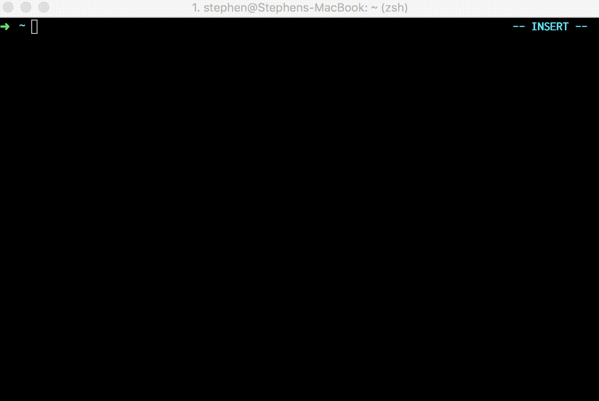

# enter


Start hacking on your projects fast. Quickly select among your projects and open a tmux session for it. 

For an explanation of the reason behind this little tool check out this [post](http://smcabrera.github.io/enter-enter/)

## Installation

### OSX

enter can be installed using brew

    $ brew install enter

### Linux

Haven't added this to any linux package managers yet but you can download the latest release here and create an executable 

```
$ wget https://github.com/smcabrera/enter/archive/1.1.0.tar.gz
$ tar -xvzf 1.1.0.tar.gz
$ cd enter-1.1.0
```

And then move `enter` to an executable path like `~/bin/`

## Usage

enter uses an environment variable to know what folder to look in for your projects, and assumes that that folder is in your home directory. For example "code", "projects" or "workspace".

```
$ export PROJECTS_DIR=code
```

You can set this environment variable in the console or include it as a line in your bashrc, zshrc, etc.

Once you've got all your projects in a single folder and named that folder the same as the environment variable (defaults to `workspace`) all you need to do is:

```
$ enter
```

And you'll get a fuzzy search of all the projects in your workspace. Whichever one you select will get its own tmux session at the root of the project folder. Any subsequent tmux windows will be opened in that same project root but when you close out of tmux you'll be back in the folder you started with.

Optionally you can also pass in an argument for the name of the project and it will create the tmux session in the same way just without giving you the list to pick from (which is generally faster since the fuzzy search lets you get away with just typing parts of the project name. 

```
 $ enter get_freaky
```


